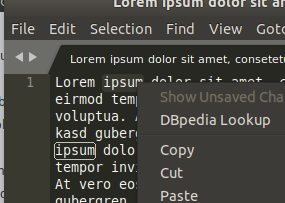
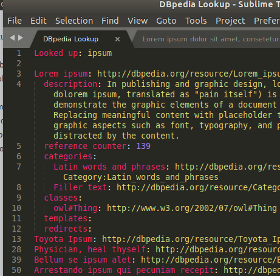

# sublime-dbpedia-lookup
A  Sublime Text 3 plugin for the DBpedia Lookup service

This plugin uses the [DBpedia Lookup](https://github.com/dbpedia/lookup) service for keyword searches.   

## Usage

The plugin provides a command in the context menu:

* right-click on a text selection for the context menu, then select _DBpedia Lookup_ to look up the selection
* right-click on the cursor position for the context menu, then select _DBpedia Lookup_ to look up the surrounding word

After that ...

* the plugin will search the DBpedia Lookup service for possible hits
* if there were hits the results will be presented in a scratch window named _DBpedia Lookup_
* all links in the result window can be right-clicked to open them in a browser, for further study

## Server configuration

By default the plugin will use the public endpoint for the DBpedia Lookup service at http://lookup.dbpedia.org. However, it is possible to also configure a _local_ endpoint. The DBpedia project provides a [Docker image](https://hub.docker.com/r/dbpedia/lookup/) that makes it possible to run the service on your own machine or elsewhere.

To use the local endpoint configure the user preferences accordingly:

* change the setting _default_server_ to _local_. The default is _remote_.
* change the setting _dbpedia_lookup_server_local_ to the address/port of your machine. The default is _http://localhost:1111_, which is the address the Docker image uses.

## License

This plugin is freely available under the [MIT license](LICENSE).

